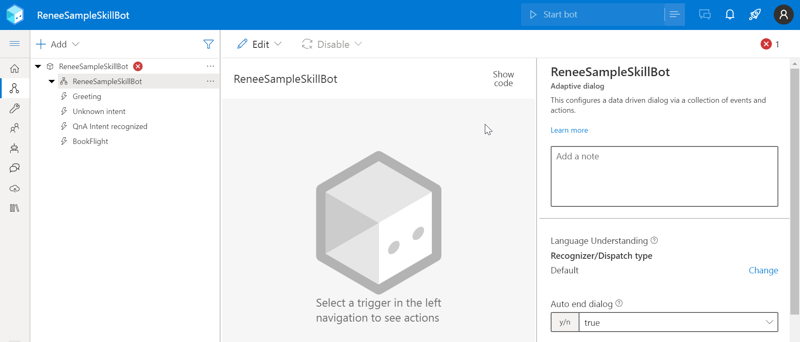
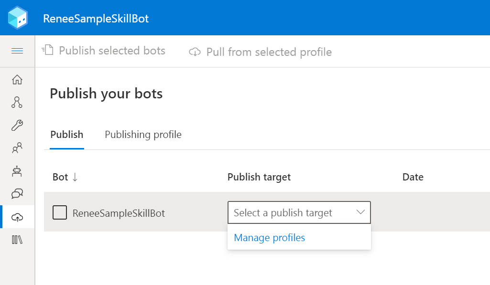
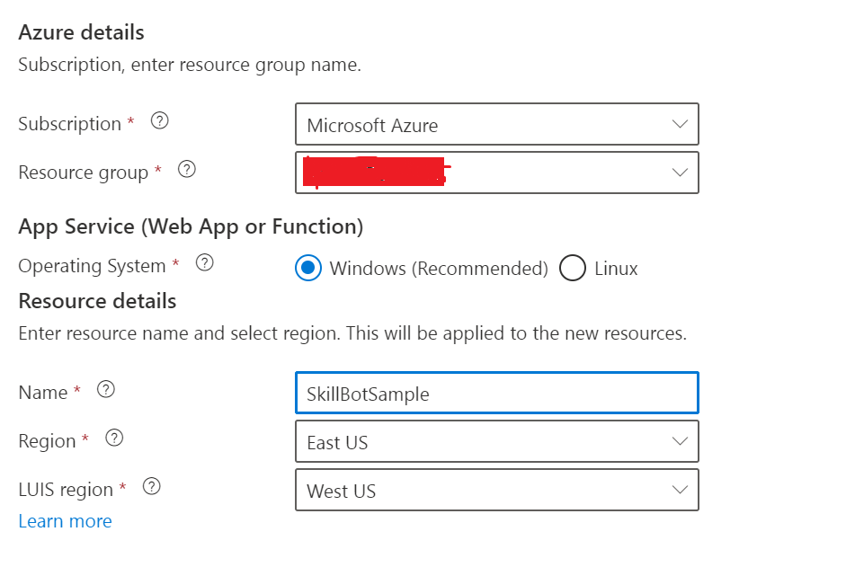
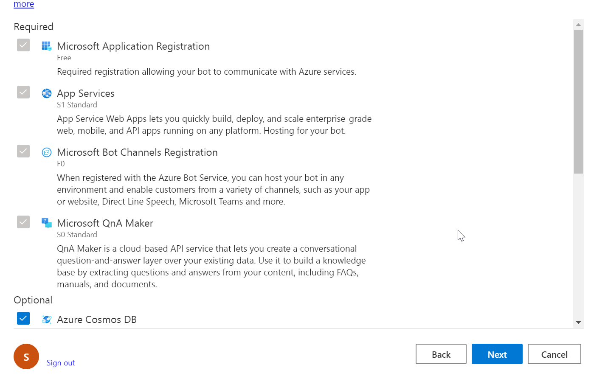
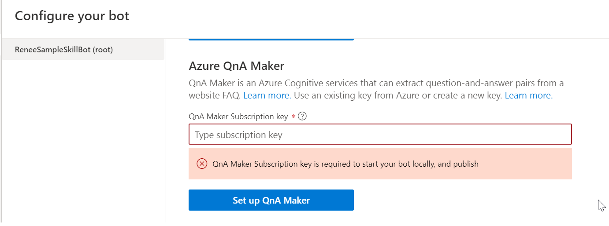

# Welcome to your new skill bot

This bot project was created using the Empty Bot template, and contains a minimal set of files necessary to have a working Skill bot. This sample shows how to work with QnA maker knowledge base and how to work with simple skill e.g BookFlight. You can extend the sample by creating a new skill that can plug in with the QnA maker 

## Next steps
### Install BotFramework Composer
Download the [Botframework Composer](https://docs.microsoft.com/en-us/composer/install-composer?tabs=windows#download-composer)  from the microsoft website

To load the sample code, either download the code or clone the code using your perferred tool. 

Launch the botframework composer and choose "open" option to open the sample bot. In this example, select the folder renee-integration-samples/skillbot/src/botFrameworkComposer/1.simple flow/ .
This will load the solution and will display as below

The red error icon shows that QnA Configuration is not been completed

### Configuration
- Configure the azure profile and azure resource where this sample skillbot need to be published as shown below

Click  Manage Profiles from the drop down and create a azure profile based your subscription. Key in the resource details based on your requirement
 
Click next to create the azure resource. This page will display both the required and optional resources that need to be created in azure. By default all the optional resources are selected for deployment. For testing purpose you can unselect or select whichever resource you require to deploy.

- Go to [QnA Maker](https://qnamaker.ai) to create a knowledge base. [Click on this microsoft link to get more more details](https://docs.microsoft.com/en-us/azure/cognitive-services/qnamaker/quickstarts/create-publish-knowledge-base?tabs=v1)

- Configure the QnA maker subsciption as shown below from Configure your bot section
 

### Working with the Sample
The manifest file(dialogchildbot-manifest-1.0.json) is located under wwwroot\Manifest\ folder. This will be used to describe as to what skills this bot supports under the "activities" section. It describes that it supports two skill - bookFlight and CampusInformation. In this working sample, bookFlight is configured to show how the Skill need to be implemented
through botframework composer. 

Using similar example, the campusInformation skill can be implemented through QnA maker. As a reference, you can refer the sample that implements QnA maker intent without a skill to understand the flow
 

### Help

Composer can help guide you through getting started building your bot. From your bot settings page (the wrench icon on the left navigation rail), click on the rocket-ship icon on the top right for some quick navigation links.

Another great resource if you're just getting started is the **[guided tutorial](https://docs.microsoft.com/en-us/composer/tutorial/tutorial-introduction)** in microsoft documentation.
