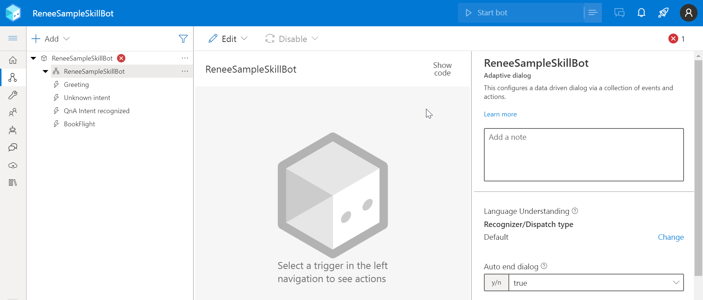
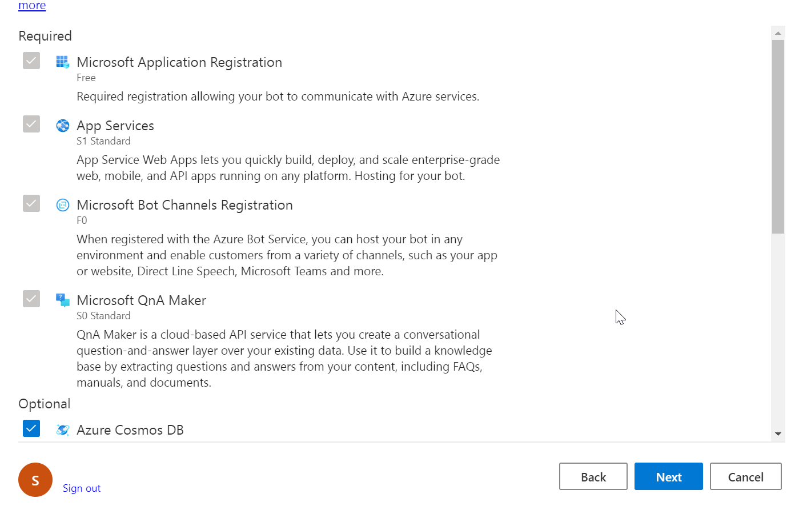
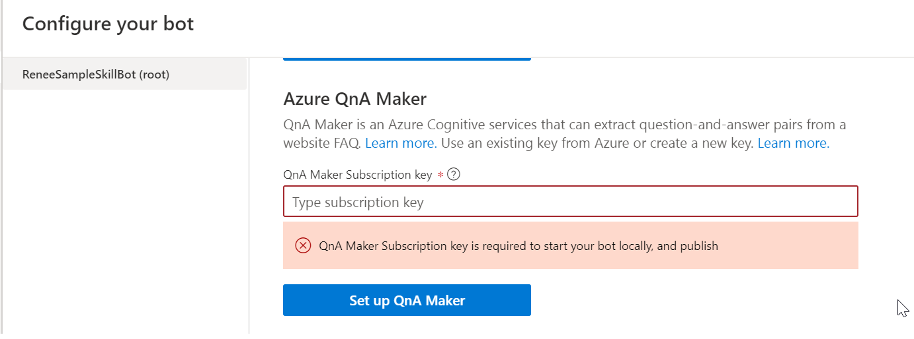

# Welcome to your new bot

This bot project was created using the Empty Bot template, and contains a minimal set of files necessary to have a working bot.

## What this sample contains?
This sample skill bot contains the simple flow to invoke the QnA maker based on the user selection. In this sample, the KB is embedded as part of skill bot. For testing the bot in azure, publish the skill bot and the KB to the respective subscription.

## Install BotFramework Composer
Download the [Botframework Composer](https://docs.microsoft.com/en-us/composer/install-composer?tabs=windows#download-composer)  from the microsoft website

Launch the botframework composer and load the solution. This will display as below

The red error icon shows that QnA Configuration is not been completed

### Configuration
- Configure the azure profile and azure resource where this sample skillbot need to be published as shown below

Click  Manage Profiles from the drop down and create a azure profile based your subscription. Key in the resource details based on your requirement
 
Click next to create the azure resource. This page will display both the required and optional resources that need to be created in azure. By default all the optional resources are selected for deployment. For testing purpose you can unselect or select whichever resource you require to deploy.

- Go to [QnA Maker](https://qnamaker.ai) to create a knowledge base. [Click on this microsoft link to get more more details](https://docs.microsoft.com/en-us/azure/cognitive-services/qnamaker/quickstarts/create-publish-knowledge-base?tabs=v1)

- Configure the QnA maker subsciption as shown below from Configure your bot section
 

