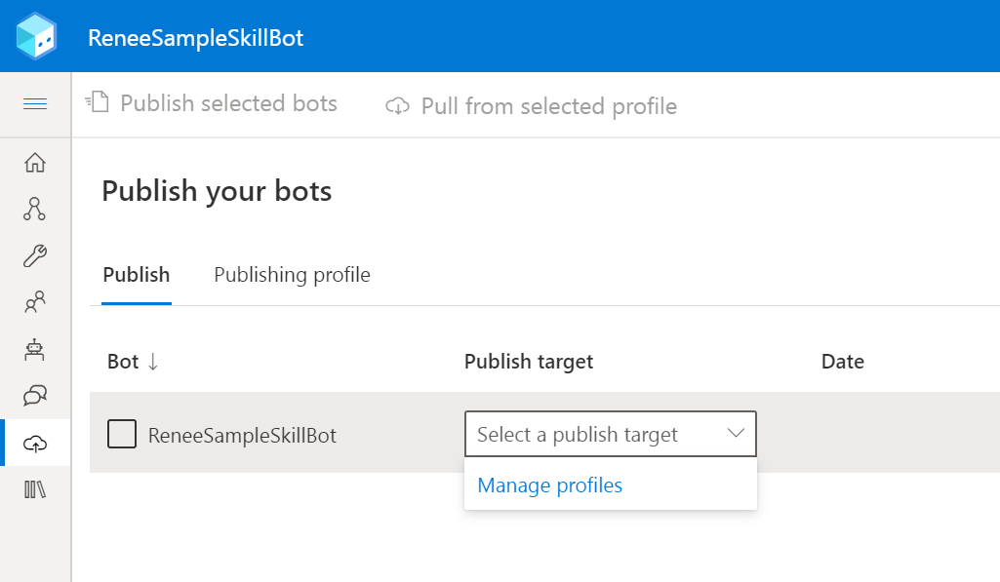
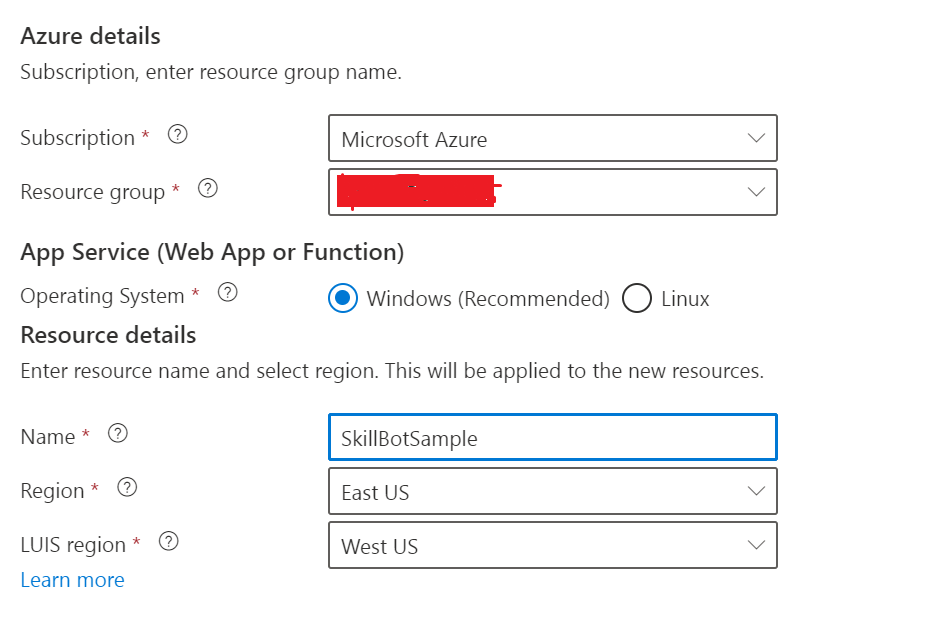

# Welcome to your new bot

This bot project was created using the Empty Bot template, and contains a minimal set of files necessary to have a working bot.

## What this sample contains?
This sample bot contains the flow as to how to invoke an external api (in this case the student information system). This sample bot is written to listen to "message recieved" unlike in skill bot which listens to the "event received". However this sample code can be extended to listen to "event received" for converting into a skill bot. The purpose of this sample is to 
1. Demonstrate how to invoke a Student Information System Call or to make any external api call through http(s)
2. How to use and genrate dynamically  rich UI capabilities like HeroCard, Thumbnail for webchat
3. How to send respose in case of chat widget like LiveAssist that doesn't support UI Cards.

## Install BotFramework Composer
Download the [Botframework Composer](https://docs.microsoft.com/en-us/composer/install-composer?tabs=windows#download-composer)  from the microsoft website

Launch the botframework composer and load the solution. This will display as below

The red error icon shows that QnA Configuration is not been completed

### Configuration
- Configure the azure profile and azure resource where this sample skillbot need to be published as shown below

Click  Manage Profiles from the drop down and create a azure profile based your subscription. Key in the resource details based on your requirement
 
Click next to create the azure resource. This page will display both the required and optional resources that need to be created in azure. By default all the optional resources are selected for deployment. For testing purpose you can unselect or select whichever resource you require to deploy.

